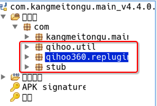

# 如何去壳脱壳

`去壳`=`去掉加固的壳`=`脱壳`

## 脱壳机制原理

* smali层：只做了一些简单的混淆
* Native 层：
  * 和如下内容相关
    * 各种so库
      * 比如libdvm.so
    * 对应着内部函数调用：
      * .init
      * .init_array
      * JNI_Onload
    * 分析修改ELF头信息
    * sub_xxx函数
      * 比如：sub_78614CD0
    * R2寄存器
    * 最后分析出：
      * ClassLoader
      * loadDex
      * multidex
  * （作者）QEver
    * 写的一个IDA的脚本=[一个dex脱壳脚本](https://bbs.pediy.com/thread-214999.htm)
    * 配合kill方法，可以实现脱绝大部分运行于dalvik上的dex壳
      * 可以dump导出正确的dex文件

## 脱壳注意事项和说明

不是所有的加固的安卓apk都能成功脱壳的。

比如，康美通的安卓apk：

* 老版本 v2.0.7 没有加固，可以直接用`Jadx`反编译得到源码的
* 新版本 v4.4.0 是`360加固保`加固的，用FDex2也无法导出`dex`，无法破解

总结出来就是：

* `没有加固`的：直接用Jadx即可导出源码
  * 比如老旧的Android的apk，很多都没有加固
    * 不管你怎么`混淆`都很容易被人分析得干干净净
* 部分加密不强的：可以脱壳
  * 包括
    * **老一代**或**免费**的`360加固保`
    * 爱加密（收费）
    * 娜迦加固（收费）
  * 用`FDex2`可以脱壳
    * 可以hook导出`dex`，再dex转`jar`，jar转`java`源码
* `腾讯乐固`，**新一代**的`360加固保`：没法脱壳
  * 即使用FDex2也无法脱壳无法破解，无法得到dex文件
    * 其中新一代的360加固保：用`art`模式+`dex2oat`相关机制，或许可以破解
      * 后续研究
        * 【未解决】用ART，oat，dex2oat相关机制去破解新一代360、腾讯等安卓apk的加固

### 对于使用加固方案的建议和结论

* 免费版的加固可以防止大多数只会反编译的小白
  * 对于普通攻击者还是很有效果的
  * 对于会用工具脱壳的，还是没太大用途的
* 除非用更加高级的，收费版的加固服务
  * 估计就很难破解，很难脱壳了
* 如果真的想要彻底防止别人破解
  * 除了考虑（用更高级的）加固方式
  * 还要花精力在app的业务逻辑层面，权限校验等方面，防止被破解

## 如何判断是哪家加固方案

通过反编译工具后，从`dex`或`jar`包的目录结构，以及相关的文件（比如`AndroidManifest.xml`）的内容，往往可以看出是哪家的加密方案：

### 腾讯乐固加密后的目录结构和典型内容

腾讯的`乐固legu`加密加壳后的apk，去用`apktool`反编译后，得到的`jar`包的目录结构是：

* `com.tencent.bugly`
* `com.tencent.bugly.legu`
  * `crashreport`
  * `proguard`
* `com.tencent.StubShell`
  * `TxAppEntry`

截图举例：


详细的目录结构和文件是：

```bash
➜  tencent ll
total 0
drwxr-xr-x  12 crifan  staff   384B  3 14 13:39 StubShell
drwxr-xr-x   3 crifan  staff    96B  3 14 13:39 bugly
➜  tencent tree .
.
├── StubShell
│   ├── SystemClassLoaderInjector.smali
│   ├── SystemInfoException.smali
│   ├── TxAppEntry.smali
│   ├── TxReceiver.smali
│   ├── XposedCheck.smali
│   ├── ZipUtil.smali
│   ├── a.smali
│   ├── b.smali
│   ├── c.smali
│   └── d.smali
└── bugly
    └── legu
        ├── Bugly.smali
        ├── BuglyStrategy$a.smali
        ├── BuglyStrategy.smali
        ├── CrashModule.smali
        ├── a.smali
        ├── b.smali
        ├── crashreport
        │   ├── BuglyHintException.smali
        │   ├── BuglyLog.smali
        │   ├── CrashReport$CrashHandleCallback.smali
        │   ├── CrashReport$UserStrategy.smali
        │   ├── CrashReport.smali
        │   。。。
        │   └── inner
        │       └── InnerAPI.smali
        └── proguard
            ├── a.smali
            ├── 。。。
            └── z.smali
14 directories, 123 files
➜  lib tree .
.
├── arm64-v8a
│   ├── libBugly.so
│   ├── libgifimage.so
│   ├── libimagepipeline.so
│   ├── libjcore119.so
│   ├── libshella-2.9.1.2.so
│   └── libstatic-webp.so
├── armeabi
│   ├── libBugly.so
│   ├── libgifimage.so
│   ├── libimagepipeline.so
│   ├── libjcore119.so
│   ├── libshella-2.9.1.2.so
│   ├── libstatic-webp.so
│   ├── mix.dex
│   └── mixz.dex
├── armeabi-v7a
│   ├── libBugly.so
│   ├── libgifimage.so
│   ├── libimagepipeline.so
│   ├── libjcore119.so
│   ├── libshella-2.9.1.2.so
│   └── libstatic-webp.so
├── 。。。
7 directories, 36 files
```

另外反编译出的`AndroidManifest.xml`内容：

```xml
<application android:allowBackup="true" android:icon="@drawable/app_logo" android:label="@string/app_name" android:name="com.tencent.StubShell.TxAppEntry" android:supportsRtl="true" android:theme="@style/AppTheme">
<meta-data android:name="TxAppEntry" android:value="com.huili.readingclub.MyApplication"/>
```

中有：

* `android:name="com.tencent.StubShell.TxAppEntry"`
  * 其中有：
    * `com.tencent.StubShell.TxAppEntry`
* `<meta-data android:name="TxAppEntry"`

也是典型的腾讯乐固的内容。

### 360加固保的加固的目录结构

360加固后的`apk`经过`dex2jar`反编译后的目录结构是：




* `com.qihoo.util`
* `com.qihoo360.replugin`
* `com.stub`

这种结构就说明是360加固保加固的。